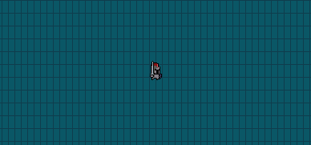

# История

# Цель

# Управление

Нажмите *правую кнопку мыши*, чтобы захватить/освободить курсор  

*W, A, S, D* - движение  

*SPACE* - новая игра

Нажмите *ESC*, чтобы выйти

### ENG
look README_eng.md

# Установка

1) Запустите команду в директории:
`cmake .`
2) Удалите `-lrt` в файле CMakeFiles/main.dir/link.txt 
3) Запустите команду в директории:
`make main`

# Запуск

Из директории:
`bin/main`

